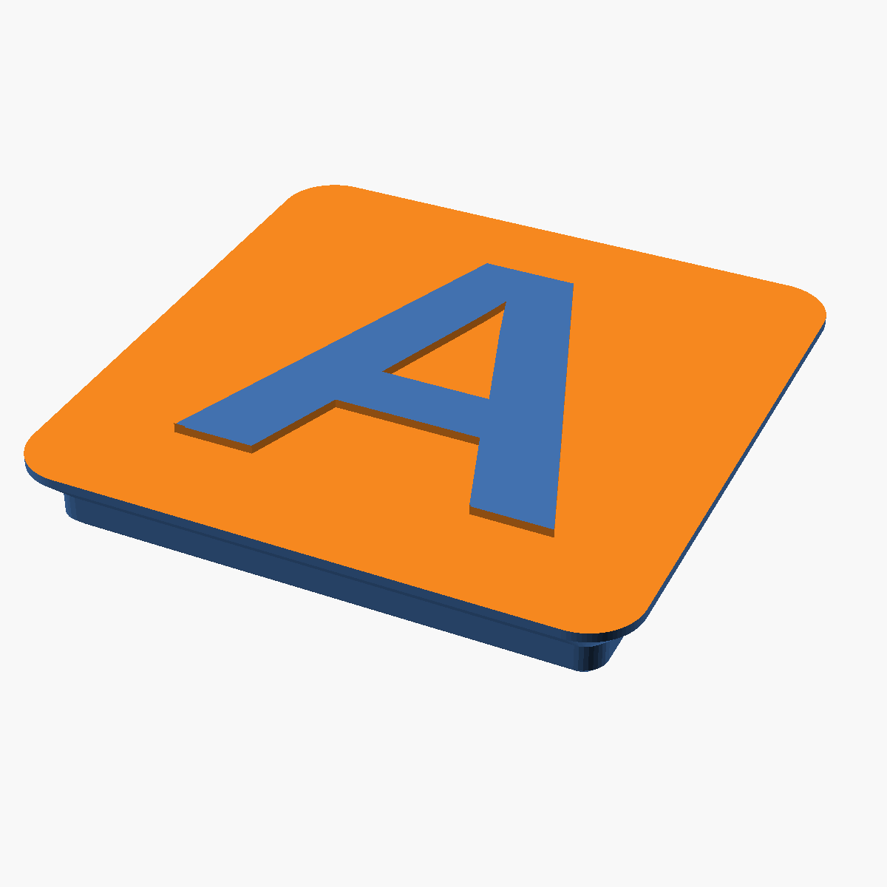

# Gridfinity Letter Tags

Parametric OpenSCAD model for 1×1 [Gridfinity](https://gridfinity.xyz)-compatible
letter tags, designed to print upside-down with a single filament swap for a
clean two-color flat top.



## How it works

- Standard Gridfinity 1×1 base (41.5 mm, R3.75, official profile) on the bottom.
- Flat top with the letter raised at the original top plane and the background
  recessed by `recess_depth` (default **0.6 mm = 3 layers at 0.2 mm**).
- Print the tile **letter face down on the build plate** and tell your slicer
  to swap filament at `z = recess_depth`. Below the swap prints in the letter
  color; above the swap fills the recess and the rest of the body in the
  background color.

## Render

Requires `openscad` and `just`.

```sh
just all        # render A-Z into build/ in parallel
just one Q      # render a single letter
just preview Q  # PNG preview (needs an X display)
just clean
```

CI renders all 26 STLs on every push and uploads them as the `letter-stls`
workflow artifact.

## Tunables (top of `letter_tag.scad`)

| Param          | Default                          | Notes                                                 |
| -------------- | -------------------------------- | ----------------------------------------------------- |
| `letter`       | `"A"`                            | Override with `-D 'letter="X"'`                       |
| `font`         | `"Liberation Sans:style=Bold"`   | Any installed font                                    |
| `letter_size`  | `28`                             | Cap-height target in mm                               |
| `tile_height`  | `6`                              | Total thickness, base bottom → top face               |
| `recess_depth` | `0.6`                            | Must equal slicer swap height (3× layer height etc.)  |
