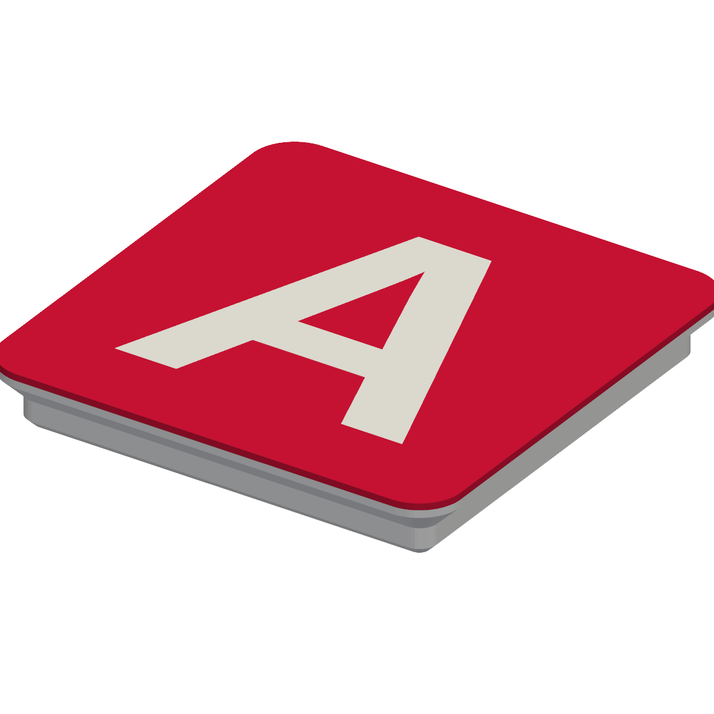
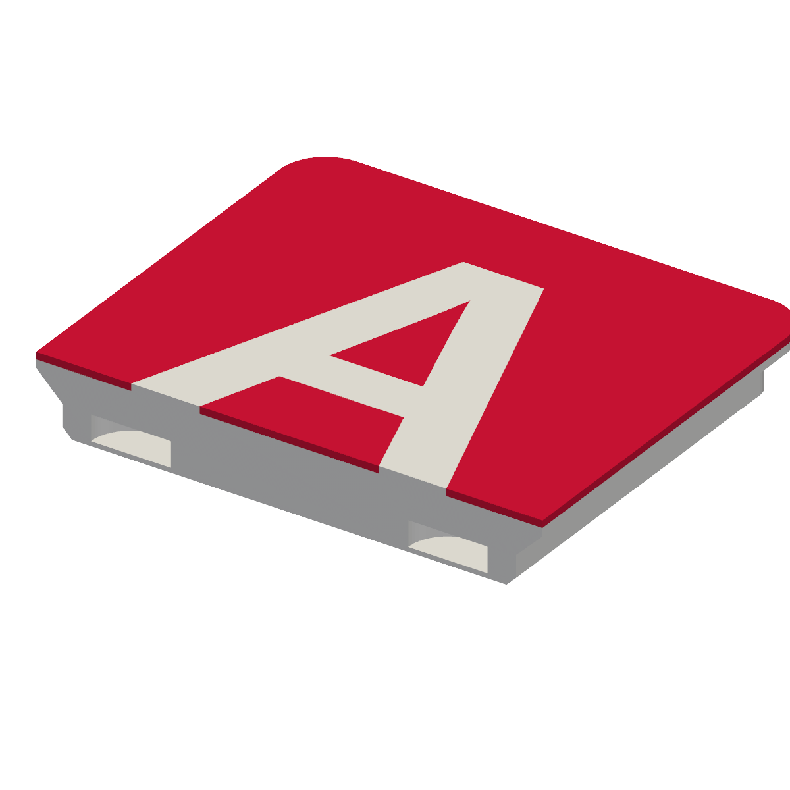

# Gridfinity Letter Tags

Parametric OpenSCAD model for 1×1 [Gridfinity](https://gridfinity.xyz)-compatible
letter tags, designed to print upside-down with a single filament swap for a
clean two-color flat top.



## How it works

- Standard Gridfinity 1×1 base (41.5 mm, R3.75, official profile) on the bottom.
- Flat top with the letter raised at the original top plane and the background
  recessed by `color_layers × layer_height` (default **3 × 0.2 mm = 0.6 mm**).
- Four 6×2 mm magnet pockets are embedded at the canonical Gridfinity corner
  positions (±13 mm from center). A **`magnet_cover_layers × layer_height`**
  ceiling (default **2 × 0.2 mm = 0.4 mm**) sits between each magnet and the
  base bottom — bridges cleanly across the 6.5 mm hole and keeps the pull strong.

## Printing

Print **letter face down on the build plate** at 0.2 mm layer height. You'll
need two pauses in your slicer:

| Pause z (mm) | Action                                                      |
| ------------ | ----------------------------------------------------------- |
| `0.6`        | Filament swap: letter color → background color              |
| `5.6`        | Drop a 6×2 mm magnet into each of the four open holes       |

After the second resume the slicer bridges the holes and prints two solid
layers to encapsulate the magnets. Cross-section showing the embedded pockets:



## Render

Requires `openscad` and `just`. Run from this directory:

```sh
just all        # render A-Z into build/ in parallel
just one Q      # render a single letter
just preview Q  # PNG preview (needs an X display)
just clean
```

CI renders all 26 3MFs on every push and uploads them as the `letter-tags`
workflow artifact.

## Tunables (top of `letter_tag.scad`)

| Param                 | Default                          | Notes                                                 |
| --------------------- | -------------------------------- | ----------------------------------------------------- |
| `layer_height`        | `0.2`                            | Slicer layer height — drives the two derived dims     |
| `letter`              | `"A"`                            | Override with `-D 'letter="X"'`                       |
| `font`                | `"Liberation Sans:style=Bold"`   | Any installed font                                    |
| `letter_size`         | `28`                             | Cap-height target in mm                               |
| `color_layers`        | `3`                              | Letter-color layers → filament-swap z                 |
| `tile_height`         | `6`                              | Total thickness, base bottom → top face               |
| `add_magnets`         | `true`                           | Embed 6×2 mm magnet pockets                           |
| `magnet_d`            | `6.5`                            | Hole Ø — canonical loose fit (glue or just press in)  |
| `magnet_cover_layers` | `2`                              | Layers between magnet and baseplate                   |
